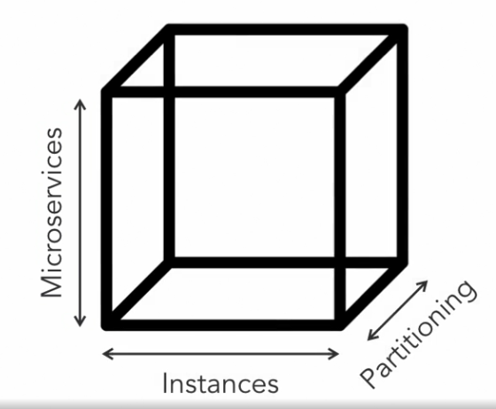
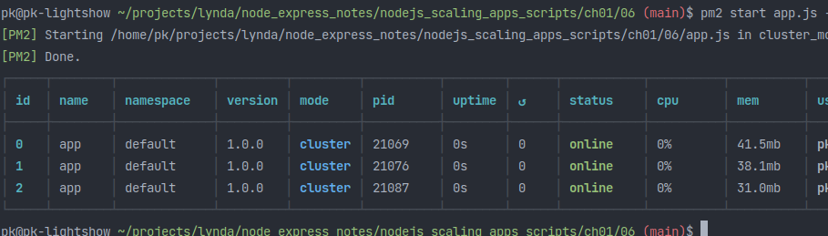
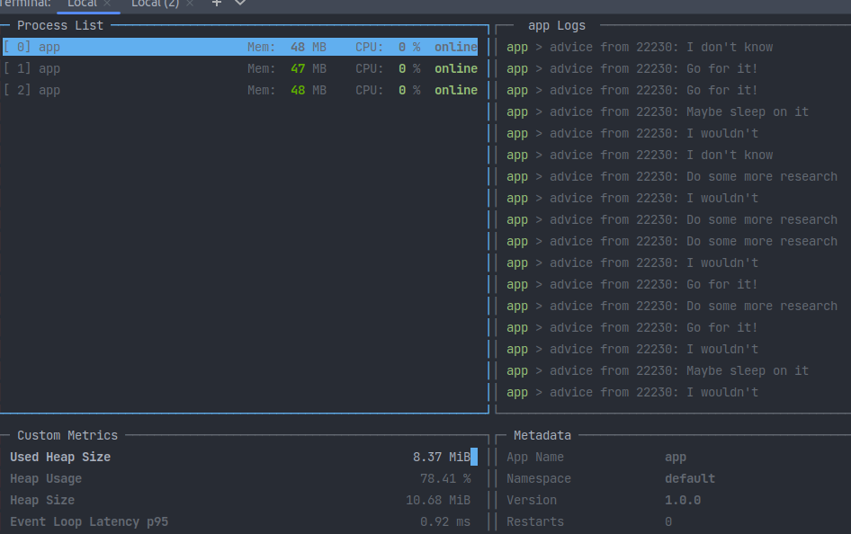

Notes from various nodejs and expressjs related courses

<!-- START doctoc generated TOC please keep comment here to allow auto update -->
<!-- DON'T EDIT THIS SECTION, INSTEAD RE-RUN doctoc TO UPDATE -->
**Table of Contents**

- [Node.js essential training](#nodejs-essential-training)
  - [Intro](#intro)
  - [Node globals](#node-globals)
    - [The global object](#the-global-object)
    - [Require / modules](#require--modules)
    - [Argument variables with process.argv](#argument-variables-with-processargv)
    - [Standard output](#standard-output)
    - [Standard input](#standard-input)
    - [setTimeout / setInterval](#settimeout--setinterval)
  - [Node modules](#node-modules)
    - [Core modules](#core-modules)
    - [readline](#readline)
    - [Export custom modules](#export-custom-modules)
    - [Building questions.js with a module](#building-questionsjs-with-a-module)
    - [Custom events with the EventEmitter](#custom-events-with-the-eventemitter)
    - [Improving the `collectAnswers.js` module using `EventEmitter`](#improving-the-collectanswersjs-module-using-eventemitter)
  - [File system basics](#file-system-basics)
    - [List directory files](#list-directory-files)
    - [Read files](#read-files)
    - [Write and append files, create directories](#write-and-append-files-create-directories)
    - [Append files](#append-files)
    - [Rename and remove files and directories](#rename-and-remove-files-and-directories)
  - [Files and streams](#files-and-streams)
    - [Readable file streams](#readable-file-streams)
    - [Writable file streams](#writable-file-streams)
    - [Create a child process with `exec`](#create-a-child-process-with-exec)
    - [Create a child process with `spawn`](#create-a-child-process-with-spawn)
- [Advanced node.js](#advanced-nodejs)
  - [Asynchronous patterns](#asynchronous-patterns)
    - [Callback pattern](#callback-pattern)
    - [Resolving promises](#resolving-promises)
    - [Rejecting promises](#rejecting-promises)
    - [The promisify function](#the-promisify-function)
    - [Sequential execution](#sequential-execution)
    - [Sequential execution with async / await](#sequential-execution-with-async--await)
    - [Parallel execution](#parallel-execution)
    - [Concurrent tasks](#concurrent-tasks)
  - [Advanced streams](#advanced-streams)
    - [Why streams?](#why-streams)
    - [Readable streams](#readable-streams)
    - [Using readable streams](#using-readable-streams)
    - [Writable streams](#writable-streams)
    - [Backpressure](#backpressure)
    - [Piping streams](#piping-streams)
    - [Duplex streams](#duplex-streams)
    - [Transform streams](#transform-streams)
  - [HTTP streaming](#http-streaming)
    - [Streaming to the browser](#streaming-to-the-browser)
    - [Handling range requests](#handling-range-requests)
    - [Forking and uploading streams](#forking-and-uploading-streams)
    - [Parsing multipart / form data](#parsing-multipart--form-data)
- [Express essential training](#express-essential-training)
  - [First steps](#first-steps)

<!-- END doctoc generated TOC please keep comment here to allow auto update -->

# Node.js essential training

Notes from the linkedin learning course by Alex Banks

## Intro

- Apache creates a new thread for each request; the threads have to wait until e.g. disk io is finished before they can continue
- Node is single threaded and runs in an asynchronous event loop, non-blocking event driven IO. When accessing resources, the event loop doesn't have to wait for e.g. a disk read to finish but can continue with other tasks. If a thread gets saturated with tasks / requests, it can be forked to provide new threads (this is not happening automatically though but is a common way to add new resources in the cloud)

Run js files with `node filename` (`.js` suffix optional)

## Node globals

### The global object

- What `window` is in the browser, `global` is in node, e.g. `global.console.log("hello")`.
- Like in the browser, all global properties are globally accessible (without the `global` prefix)

https://nodejs.org/api/globals.html

Some commonly used globals: `__dirname`, `__filename`

### Require / modules

Files can be imported using the *common js module pattern* to import modules that come with nodejs or external / own modules:

    const path = require("path") // ships with nodejs
    console.log(`The filename is ${path.basename(__filename)}`);

### Argument variables with process.argv

`process.argv` contains an array with

- 0: path to the systems node binary that executes the current file
- 1: the path of the current file
- 2...: the passed arguments

    // firstFile.js
    console.log(process.argv);
    console.log(`Entered ${process.argv.slice(2)}`);

    const [, , myFirstArg, mySecondArg] = process.argv; // using destructuring
    console.log(`${myFirstArg} ${mySecondArg}`);
    
    $ node firstFile.js hey hey
    Entered /home/pk/.nvm/versions/node/v16.17.0/bin/node,/home/pk/projects/lynda/node_express_notes/ch03/firstFile.js,hey,hey
    Entered hey,hey
    hey hey

Using flags and values in the arguments and obtain their values using a self defined `grab` function:

    function grab(flag) {
        const valueIdx = process.argv.indexOf(flag) + 1;
        return process.argv.length > valueIdx ? process.argv[valueIdx] : 'not provided';
    }
    
    const user = grab("--user");
    const pass = grab("--pass");
    console.log(`${user}:${pass}`);

Other `process` properties: `process.pid`, `process.versions.node`

### Standard output

- Communicate with the running process using the `process.stdin` and `process.stdout` streams.
- `process.stdout` doesn't automatically add a new line like `console.log`

        `process.stdout.write("Hello world\n\n");

### Standard input

`process.stdin.on('data', data => process.stdout.write(`\n${data.toString().trim()}\n`);`

`data` is a stringbuffer that must be converted with `toString`; The above listener runs asynchronously until stopped (e.g. with `process.exit()` or ctrl-c).

A listener for `exit` can also be defined that runs a function when the program is terminated with `process.on('exit', ()=> /*...*/)`.

Example program:

    const questions = [
        "what's your name?",
        "what would you rather be doing?",
        "what's your preferred programming language?"
    ]
    
    const ask = (i=0) => {
        process.stdout.write(`\n\n${questions[i]}`);
        process.stdout.write(` > \n\n`);
    }
    
    const answers = [];
    
    ask(0);
    process.stdin.on('data', data => {
        const answer = data.toString().trim();
        answers.push(answer);
        if(answers.length < questions.length) {
            ask(answers.length);
        } else {
            process.exit();
        }
    });
    
    process.on("exit", ()=> {
        for(let i in questions) {
            process.stdout.write(`\n${questions[i]}: ${answers[i]}`);
        }
    })

### setTimeout / setInterval

Same as in browser JS

Progress percentage example:

    const waitTime = 3000;
    const waitInterval = 500;
    let currentTime = 0;
    
    const interval = setInterval(() => {
        const percent = Math.floor((currentTime+=waitInterval) / (waitTime / 100));
        process.stdout.clearLine();
        process.stdout.cursorTo(0);
        process.stdout.write(`${percent}% done`);
    }, waitInterval);
    setTimeout(() => clearInterval(interval), waitTime);

## Node modules

### Core modules

    Core moduleas come with nodejs and don't need to be installed separately.
    
    Some examples:
    
    const path = require("path");
    const util = require("util");
    const v8 = require("v8");
    const {getHeapStatistics} = require("v8"); // destructured import as usual
    
    const dirUploads = path.join(__dirname, 'www', 'files', 'uploads');
    console.log(dirUploads); // ./www/files/uploads
    
    util.log(path.basename(__filename)); // with date (util.log is deprecated though)
    
    util.log(getHeapStatistics());

### readline

Questions example using readline (using callbacks as nodejs is asynchronous, so we can't just do a `for` loop of the questions; for a synchronous version, `readline-sync` can be installed and used instead): 

    const readline = require("readline");
    
    function collectAnswers(questions, callback) {
        const rl = readline.createInterface({
            input: process.stdin,
            output: process.stdout
        });
    
        const questionAnswered = answer => {
            answers.push(answer);
            if (answers.length < questions.length) {
                rl.question(questions[answers.length], questionAnswered);
            } else {
                callback(answers);
            }
        }
    
        const answers = [];
        const [firstQuestion] = questions;
    
        rl.question(firstQuestion, questionAnswered);
    }
    
    const questions = [
        "what's your name?",
        "what would you rather be doing?",
        "what's your preferred programming language?"
    ];
    
    collectAnswers(questions, answers => {
        console.log(answers);
        process.exit();
    })
    
### Export custom modules

Simplest form:

myModule.js:

    module.exports = "pkro";

app.js:

    const name = require("./myModule"); // name is "pkro"

All variables inside the module are scoped to the module and can be modified by functions in the same scope (=same module):

myModule:

    let count = 0;
    
    const inc = () => ++count;
    const dec = () => --count;
    
    const getCount = () => count;
    
    module.exports = {
        inc,
        dec,
        getCount
    };

app.js:

    const {inc, dec, getCount} = require('./myModule');
    // or const counter = require('./myModule'), then use counter.inc() etc.

    console.log(getCount()); // 0
    inc();
    inc();
    inc();
    console.log(getCount()); // 3

### Building questions.js with a module

`collectAnswers.js` module:

    const readline =require("readline");
    
    const rl = readline.createInterface({
        input: process.stdin,
        output: process.stdout
    });
    
    module.exports = (questions, callback = answers => answers) => { // optional callback argument
        const questionAnswered = answer => {
            answers.push(answer);
            if (answers.length < questions.length) {
                rl.question(questions[answers.length], questionAnswered);
            } else {
                callback(answers);
            }
        }
    
        const answers = [];
        const [firstQuestion] = questions;
    
        rl.question(firstQuestion, questionAnswered);
    }

`ask.js`:

    const collectAnswers = require('./lib/collectAnswers');
    
    const questions = [
        "what's your name?",
        "what would you rather be doing?",
        "what's your preferred programming language?"
    ];
    
    collectAnswers(questions, answers => {
        console.log(answers);
        process.exit();
    })

### Custom events with the EventEmitter

`EventEmitter` is used to handle and raise custom events (asynchronously) and is nodes implementation of the pub/sub design pattern

    const events = require('events');
    
    const emitter = new events.EventEmitter();
    // create custom event; message and user are the second and third argument
    // passed to emitter.emit in this case (any number of arguments can be used)
    emitter.on('myCustomEvent', (message, user)=>{
        console.log(`${user} said ${message}`);
    })
    
    emitter.emit('myCustomEvent', 'Hello World', 'Computer'); // Computer said Hello World
    emitter.emit('myCustomEvent', 'hey ho', 'pkro'); // pkro said hey ho
    
    process.stdin.on("data", data => {
        const input = data.toString().trim();
        if(input.toLowerCase() === 'exit') {
            emitter.emit("myCustomEvent", "Goodbye", 'process');
            process.exit();
        }
        emitter.emit("myCustomEvent", input, "terminal");
    });

### Improving the `collectAnswers.js` module using `EventEmitter`

`collectAnswers.js`:

    const readline =require("readline");
    const {EventEmitter} = require('events');
    
    const rl = readline.createInterface({
        input: process.stdin,
        output: process.stdout
    });
    
    module.exports = (questions, callback = answers => answers) => {
        const emitter = new EventEmitter();
    
        const questionAnswered = answer => {
            emitter.emit("answer", answer);
            answers.push(answer);
            if (answers.length < questions.length) {
                rl.question(questions[answers.length], questionAnswered);
            } else {
                emitter.emit("complete", answers);
                callback(answers);
            }
        }
    
        const answers = [];
        const [firstQuestion] = questions;
    
        rl.question(firstQuestion, questionAnswered);
    
        return emitter;
    }

`ask.js`:

    const collectAnswers = require('./lib/collectAnswers');
    
    const questions = [
        "what's your name?",
        "what would you rather be doing?",
        "what's your preferred programming language?"
    ];
    
    const answerEvents = collectAnswers(questions);
    
    answerEvents.on("answer", answer => console.log(`event: question answered with ${answer}`));
    answerEvents.on("complete", answers => {
        console.log(answers);
        process.exit();
    });
    // more than one listener can be defined for a given event
    // they are executed in the order they are defined
    answerEvents.on("complete", () => process.exit());

## File system basics

Most functions of the `fs` module have synchronous counterparts with a `Sync` suffix.

### List directory files

    const fs = require('fs');
    
    // list files (synchronously), blocking further execution until done
    const files = fs.readdirSync("./assets");
    console.log(files);
    
    // asnychronously
    fs.readdir('./assets', (err, files) => {
        if (err) {
            throw err;
        }
        console.log(files);
    })

### Read files

    const fs = require('fs');
    
    // sync
    const text = fs.readFileSync('./assets/Readme.md', "UTF-8");
    console.log(text.toString());
    
    // async (no error handling for brevity)
    fs.readFile('./assets/Readme.md', "utf-8", (err, text) => console.log(text.toString()) )

    // read binary (no encoding defaults to 'binary')
    const img = fs.readFileSync('./assets/alex.jpg');

### Write and append files, create directories

Examples of both async and sync versions omitted from here on if they don't add anything, as is the `fs` import.

    const md = `
    # Title
    
    Some text
    `;
    
    if (!fs.existsSync('./assets/tmp')) {
        console.log('directory exists');
        fs.mkdir('./assets/tmp', err => {
            // err thrown if directory already exists or not a writable location
            if (err) { 
                throw err;
            }
            createFile();
        });
    }
    
    function createFile() {
        fs.writeFile('./assets/tmp/myfile.md', md.trim(), err => {
            if (err) throw err; // NO error thrown if file exists
            console.log("File written");
        });
    }

### Append files

Note: `json files` can be required (no file system needed).

Append creates a file if it doesn't exist.

    const fs = require('fs');
    const colorData = require('./assets/colors.json');
    
    colorData.colorList.forEach((entry) => {
        fs.appendFile('./assets/myfile.md', `\n- ${entry.color} is ${entry.hex} in hex`, err => { if (err) throw err});
    });

### Rename and remove files and directories

    const fs = require('fs');
    const path = require('path');
    
    // build OS specifice path, e.g. '\' instead of '/' for windows
    const basePath = path.join(__dirname, 'assets');
    const tmpPath = path.join(basePath, 'tmp');
    const fileToCreate = path.join(basePath, 'randomfile.txt');
    const movedFile = path.join(tmpPath, 'movedfile.txt');
    
    if(!fs.existsSync(tmpPath)) {
        fs.mkdirSync(tmpPath);
    }
    
    fs.writeFileSync(fileToCreate, 'some text', 'utf-8');
    // rename can be used to move a file or directory (no separate move function)
    fs.renameSync(fileToCreate, movedFile);
    
    // rmSync also accepts options
    fs.readdirSync(tmpPath).forEach(fileName => fs.rmSync(path.join(tmpPath, fileName)));
    
    // alternative to rm / rmSync:
    // fs.unlinkSync(movedFile);
    
    // would fail if not empty
    fs.rmdirSync(tmpPath);

## Files and streams

Streams are used to read / write files, communicate with the network / internet and with processes and other input / outputs like the terminal. `process.stdin` is a stream.

### Readable file streams

Reading a file chunk by chunk (defaulting to 64kb chunks):

    const fs = require('fs');
    const path = require('path');
    
    const readStream = fs.createReadStream(path.join(__dirname, 'assets', 'lorum-ipsum.md'), 'utf-8');
    
    console.log("type something...");
    //process.stdin.on("data", data => {
    readStream.on("data", data => {
        console.log(`I read ${data.length - 1} characters of text`);
    });

    /* output:
    I read 65535 characters of text
    I read 65535 characters of text
    ...
    I read 56950 characters of text*/

    // just read the first chunk
    readStream.once('data', data => console.log(data));
    
    readStream.on('end', () => console.log("finished"));

### Writable file streams

When creating a write stream, the index is set to 0, even if it's an existing file.
    
    // write to the stdout write stream
    process.stdout.write('hello');
    
    // same for file write stream
    const writeStream = fs.createWriteStream(path.join(__dirname, 'assets', 'streamwritten.txt'), 'utf-8');
    
    // overwrites content of the file if it existed before creating the writeStream
    // as createWriteStream sets the file pointer to 0
    writeStream.write('hello');
    // appends to the file as the file pointer is now updated
    writeStream.write(' world'); // content is now "hello world"
    
    // write terminal input to file until ctrl-c
    process.stdin.on("data", data => {
        writeStream.write(data);
    });
    
    // the same but shorter:
    process.stdin.pipe(writeStream);
    
    
    // copy content from readstream to write stream (file)
    // here it appends to the stuff already appended above
    // as we didn't create a new writeStream
    const readStream = fs.createReadStream(path.join(__dirname, 'assets', 'lorum-ipsum.md'));
    
    // same as readStream.pipe(writeStream);
    readStream.on("data", data => {
        writeStream.write(data);
    });
    

### Create a child process with `exec`

Use `exec` to execute any *synchronous* process asynchronously (or synchronously using `execSync`).

It can also be used to start other node processes (e.g. `cp.exec("node myScript", (...) => {...})`) and stream its output.

It is not designed for asynchronous or long running processes.

    const cp = require("child_process");
    
    cp.exec("ls -l", (err, data, stderr) => {
        if(err) {
            console.log(stderr); // the error message you'd get on the command line, e.g. /bin/sh: 1: lsdfdsfd: not found
            throw err; // the full error (including stderr)
        }
        console.log(data);
    });
    
    console.log("faster!")
    
    
    /*
    output:
    
    faster!
    total 88
    -rw-rw-r-- 1 pk pk   241 Sep 18 08:41 append.js
    -rw-rw-r-- 1 pk pk   134 Sep 17 18:34 app.js
    -rw-rw-r-- 1 pk pk   591 Sep 17 20:50 ask.js
    */

### Create a child process with `spawn`

`spawn` can be used to start asynchronous processes.

    const cp = require("child_process");
    
    // first arg: command, second arg: array with all command parameters
    const questionApp = cp.spawn("node", ['ask.js']);
    
    questionApp.stdin.write("pkro\n");
    questionApp.stdin.write("blah\n");
    questionApp.stdin.write("blubb\n");
    
    questionApp.stdout.on("data", data => {
        console.log(`from the question app: ${data}`);
    });
    
    questionApp.on('close', () => console.log("questionApp process exited"));
    
    /*
    from the question app: what's your name?
    
    from the question app: event: question answered with pkro
    what would you rather be doing?event: question answered with blah
    what's your preferred programming language?event: question answered with blubb
    
    from the question app: [ 'pkro', 'blah', 'blubb' ]
    
    questionApp process exited
     */

# Advanced node.js

Notes from the linkedin learning course by Alex Banks

## Asynchronous patterns

### Callback pattern

A callback is a block of instructions wrapped in a function that is called when an asynchronous call has completed.

Starting point: synchronous

    function hideString(str) {
        return str.replace(/[a-zA-Z]/g, 'X');
    }
    const hidden = hideString("Hello World");
    console.log( hidden );
    console.log('end');

Output:

    XXXXX XXXXX
    end

[Continuation-passing style (cps)](https://en.wikipedia.org/wiki/Continuation-passing_style):

This is still operating synchronously (the thread executes in order).

    // done = callback function
    function hideString(str, done) {
        done(str.replace(/[a-zA-Z]/g, 'X'));
    }
    hideString("Hello World", hidden => console.log(hidden));
    
    console.log('end');

Output:

    XXXXX XXXXX
    end

Asynchronous:

    function hideString(str, done = str => null) {
        //nextTick = next iteration of event loop
        process.nextTick(()=>done(str.replace(/[a-zA-Z]/g, 'X')));
    }
    hideString("Hello World", hidden => console.log(hidden));
    console.log('end');

Output:
    
    end
    XXXXX XXXXX

Sequential execution of callbacks, aka callback hell (antipattern):

    function delay(seconds, callback) {
        setTimeout(callback, seconds * 1000);
    }
    
    console.log("starting delays");
    delay(2, () => {
        console.log("two seconds");
        delay(1, () => {
            console.log("three seconds");
            delay(1, () => {
                console.log("four seconds");
            });
        });
    });
    
    console.log('end');

Output:

    starting delays
    end
    two seconds
    three seconds
    four seconds

### Resolving promises

A promise is an object that can be used to represent the eventual completion of an asynchronous operation.

Passing a function without parameters as the callback that should be executed after the asynchronous operation:

    const delay = (seconds) => new Promise((resolve, reject)=> {
        setTimeout(resolve, seconds * 1000);
    });
    
    delay(1)
        .then(() => console.log("the delay has ended"));
    
    console.log('end first tick');

Output:

    end first tick
    the delay has ended

Passing a function **with** a parameter for the result of the operation (same result as above):

    const delay = (seconds) => new Promise((resolve, reject)=> {
        setTimeout(()=> {
            resolve('the delay has ended')
        }, seconds * 1000);
    });
    
    delay(1)
        .then((result) => console.log(result));
        // or just .then(console.log);

Chaining `then` callbacks:

    delay(1)
        .then(console.log)
        .then(() => console.log("hey, done"));

The function passed to `then` can also return a result that will be used in the next chained `then`:

    delay(1)
        .then(()=>42)
        .then(console.log); // 42

### Rejecting promises

Without catching an error:

    const delay = (seconds) => new Promise((resolve, reject) => {
        throw new Error("failed"); // something going wrong
        setTimeout(resolve, seconds * 1000);
    });
    
    delay(1)
        .then(()=>console.log('all went well'))

Output:

    Error: failed
    at /home/pk/projects/lynda/node_express_notes/advance_nodejs_scripts/ch01_callback.js:2:11
    ...
    
With catching the error:

    delay(1)
        .then(()=>console.log('all went well'))
        .catch(err=>console.log(err.message))

Output:

    failed

It is not necessary to throw an error as we can use the reject function based on any logic:

    const delay = (seconds) => new Promise((resolve, reject) => {
        if(seconds > 5) reject(new Error("Max 5 seconds allowed"));

        setTimeout(resolve, seconds * 1000);
    });

There's nothing special about the `Error` object (though it's best practice), it would have worked with `reject({message: 'error occured'})` as well.

### The promisify function

Node comes with the `promisify` function to convert functions that use callbacks to promises. The callbacks in the function to be converted mus follow the `(error, value)` parameter order. 

The function and usage we want to convert:

    const delay = (seconds, callback) => {
        if (seconds > 3) {
            callback(new Error(`${seconds} seconds it too long!`));
        } else {
            setTimeout(() =>
                    callback(null, `the ${seconds} second delay is over.`),
                seconds
            );
        }
    }

    delay(2, (error, message) => {
        if (error) {
            console.log(error.message);
        } else {
            console.log(message);
        }
    });

With promisify:

    const {promisify} = require('util');
    const delay = (seconds, callback) => {
       // same
    }

    const promiseDelay = promisify(delay);

    promiseDelay(2)
        .then(console.log)
        .catch(err => console.log(err.message));

`writeFile` form `fs` is usually a callback function, but we can convert it to a promise as well:

    const {promisify} = require('util');
    const fs = require('fs');
    
    const writeFile = promisify(fs.writeFile);
    
    writeFile('./sample.txt', 'a sample text')
        .then(() => console.log("success"))
        .catch(err => console.log(err.message));

### Sequential execution

Sequential execution using callback hell:

    var fs = require('fs');
    var beep = () => process.stdout.write("\x07");
    
    const doStuffSequentially = () => {
        console.log('starting');
        setTimeout(() => {
            console.log('waiting');
            setTimeout(() => {
                console.log('waiting some more');
                fs.writeFile('file.txt', 'Sample File...', error => {
                    if (error) {
                        console.error(error);
                    } else {
                        beep();
                        console.log('file.txt created')
                        setTimeout(() => {
                            beep();
                            fs.unlink('file.txt', error => {
                                if (error) {
                                    console.error(error);
                                } else {
                                    console.log('file.txt removed');
                                    console.log('sequential execution complete');
                                }
                            })
                        }, 3000)
                    }
                });
            }, 2000)
        }, 1000)
    }
    
    doStuffSequentially();

Using promises:

    var fs = require('fs');
    var { promisify } = require('util');
    var writeFile = promisify(fs.writeFile);
    var unlink = promisify(fs.unlink);
    var beep = () => process.stdout.write("\x07");
    var delay = (seconds) => new Promise((resolves) => {
        setTimeout(resolves, seconds*1000);
    })
    
    // creates a new promise object and automatically resolve it
    // just created to chain up the sequentially executed .then methods
    const doStuffSequentially = () => Promise.resolve()
      .then(() => console.log('starting'))
      .then(() => delay(1))
      .then(() => 'waiting')
      .then(console.log)
      .then(() => delay(2))
      .then(() => writeFile('file.txt', 'Sample File...'))
      .then(beep)
      .then(() => 'file.txt created')
      .then(console.log)
      .then(() => delay(3))
      .then(() => unlink('file.txt'))
      .then(beep)
      .then(() => 'file.txt removed')
      .then(console.log)
      .catch(console.error);
    
    doStuffSequentially()
      .then(() => console.log('again again!!!'))
      .then(() => doStuffSequentially())
      .then(() => console.log('enough already...'));

### Sequential execution with async / await

    const fs = require('fs');
    // ... same as above
    
    // the function that contains await must be defined as async
    async function doStuffSequentially () {
        console.log('starting');
        await delay(1);
        console.log("waiting");
        await delay(2);
        // we can now also be specific in which lines we want to catch errors
        try {
            await writeFile('file.txt', 'sample file...');
            beep();
            console.log("file created");
        } catch (error) {
            console.log(error.message);
        }
        await delay(1);
        await unlink('file.txt');
        console.log("file deleted");
        return 'success';
    }
    
    // call:
    doStuffSequentially().then(msg => console.log(msg));
    
    // or in an async function
    async function start() {
        const res = await doStuffSequentially();
        console.log(res);
    }
    start();
    
    // or as an iifi (imediately invoked function expression), anti-pattern now
    (async function () {
        const res = await doStuffSequentially();
        console.log(res);
    })();

Note that the 3 ways to call the function shown above would *still* be executed in parallel / asynchronously, so there will be errors if all 3 of them run.

### Parallel execution

`Promise.all` returns a single promise that is returned once all the promises passed into it in an array are resolved.

    Promise.all([
        // executed in parallel
        delay(2).then(()=>"promise 1 finished"),
        delay(3).then(()=>"promise 2 finished"),
        delay(5).then(()=>"promise 3 finished"), // longest, 5 seconds
    ]).then(res => console.log(res)); // executed after all promises are resolved
    
    /*
    Result (after 5 seconds):
    [ 'promise 1 finished', 'promise 2 finished', 'promise 3 finished' ]
    */

`Promise.all` will reject when *any* of the promises rejects.

`Promise.allSettled` will wait for all promises to complete, no matter if rejected or resolved.

`Promise.race` resolves after the *first* promise has resolved (the other promises are still executed though).

    Promise.race([
        // executed in parallel
        delay(2).then(()=>"I will not be returned"),
        delay(1).then(()=>"promise 2 finished"),
        delay(3).then(()=>"I will not be returned").then(()=>console.log("longest promise finished as well")), // longest, 5 seconds
    ]).then(res => console.log(res)); // executed after all promises are resolved
    
    /*
    Result (after 5 seconds):
    promise 2 finished // after 1 second, the ONLY result of the Promise.race promise
    longest promise finished as well // after five seconds, the console log is not a result but a side effect of the sub-promise
    */

### Concurrent tasks

Example of a promise queue with the ability to limit parallel execution, with console visualization:

    import logUpdate  from 'log-update'; // must be installed via npm
    const toX = () => 'X';
    
    const delay = (seconds) => new Promise((resolves) => {
        setTimeout(resolves, seconds * 1000);
    });
    
    const tasks = [
        delay(4),
        delay(6),
        delay(4),
        delay(3),
        delay(5),
        delay(7),
        delay(9),
        delay(10),
        delay(3),
        delay(5)
    ];
    
    class PromiseQueue {
        constructor(promises = [], concurrentCount = 1) {
            this.concurrent = concurrentCount;
            this.total = promises.length;
            this.todo = promises;
            this.running = [];
            this.complete = [];
        }
    
        get shouldRunAnother() {
            return (this.running.length < this.concurrent) && this.todo.length;
        }
    
        // just to visualize what's happening
        graphTasks() {
            const {todo, running, complete} = this;
            logUpdate(`
            todo: [${todo.map(toX)}]
            running: [${running.map(toX)}]
            complete: [${complete.map(toX)}]
            `)
        }
    
        run() {
            while (this.shouldRunAnother) {
                var promise = this.todo.shift();
                promise.then(() => {
                    this.complete.push(this.running.shift());
                    this.graphTasks();
                    this.run();
                })
                this.running.push(promise);
                this.graphTasks();
            }
        }
    }
    
    const delayQueue = new PromiseQueue(tasks, 2);
    delayQueue.run();

## Advanced streams

### Why streams?

`node --trace_gc myfile.js` shows garbage collection during runtime.
Entries with `Mark-sweep` indicate high activity as they stop the node process for garbage collection. `Scavenge` entries indicate a smaller footprint.

Buffering locally has a much higher garbage collection overhead and memory usage than streaming as the video file is never fully loaded into memory:

Buffer version:

    import fs  from 'fs';
    import http from 'http';
    const file = './powder-day.mp4';

    http.createServer((req, res) => {
        fs.readFile(file, (error, data) => {
            if (error) {
                console.log('hmmmm: ', error);
            }
            res.writeHeader(200, { 'Content-Type': 'video/mp4' });
            res.end(data);
        })
    
    }).listen(3000, () => console.log('buffer - http://localhost:3000'));

Streaming version:

    http.createServer((req, res) => {
        res.writeHeader(200, { 'Content-Type': 'video/mp4' });
        fs.createReadStream(file)
            .pipe(res)
            .on('error', console.error);
    
    }).listen(3000, () => console.log('stream - http://localhost:3000'));

### Readable streams

A custom stream from anything can be created by extending `Readable` from the included `stream` library.

Streams have 2 modes:  

- binary mode: read as binary or string (by setting the encoding type to `utf-8` in the `super` constructor call)
- object mode: data as javascript objects. Enable by setting `objectMode: true` in the constructor.

String mode:

    import {Readable} from 'stream';
    
    const peaks = [
        "Tallac",
        "Ralston",
        "Rubicon",
        "Twin Peaks",
        "Castle Peak",
        "Rose",
        "Freel Peak"
    ];
    
    class StreamFromArray extends Readable {
        constructor(array) {
            super({encoding: 'utf-8'});
            this.array = array;
            this.index = 0;
        }
    
        _read() { // must be implemented
            if (this.index <= this.array.length) {
                const chunk = this.array[this.index];
                this.push(chunk);
                this.index++;
            } else {
                this.push(null); // indicate that stream is over
            }
        }
    }
    
    const peakStream = new StreamFromArray(peaks);
    
    peakStream.on('data', chunk => console.log(chunk));
    peakStream.on('end', () => console.log('done'));

Result:

    Tallac
    Ralston
    ...
    done

Object mode:

    ...
    super({objectMode: true});
    ...
    const chunk = {
        data: this.array[this.index],
        index: this.index
    }

Result:

    { data: 'Tallac', index: 0 }
    { data: 'Ralston', index: 1 }
    ...
    { data: undefined, index: 7 }
    done

### Using readable streams

Streams in **non-flowing mode** (e.g `process.stdin`) have to be "asked for" continuing the stream:

    process.stdin.on('data', data=>console.log(data.toString().trim()));

Streams in **flowing mode** automatically push the data chunks to the pipeline:

    import fs from 'fs';
    const readStream = fs.createReadStream('../01/powder-day.mp4');
    readStream.on('data', chunk => {
        console.log(chunk.length);
    });

To convert a flowing read stream to non-flowing, we can use `readStream.pause()` and use `readStream.read()` to read the next chunk. `readStream.resume()` converts it back to flowing mode.

    const readStream = fs.createReadStream('../01/powder-day.mp4');
    
    let chunksRead = 0;
    readStream.on('data', chunk => {
        chunksRead++;
        console.log(`read ${chunksRead} chunks`);
    });
    // pauses before first read from the stream
    readStream.pause();
    // wait for input / enter before reading the next chunk
    process.stdin.on('data', data => {
        if(data.toString().trim() === 'finish') {
            readStream.resume(); // reads all remaining chunks
        }
        readStream.read()
    });

### Writable streams

Same info as in the essential training course above.

    const readStream = fs.createReadStream('../01/powder-day.mp4');
    const writeStream = fs.createWriteStream('./copy.mp4');
    
    readStream.on('data', chunk => {
        writeStream.write(chunk);
    });
    
    // or, shorter:
    //readStream.pipe(writeStream);
    
    readStream.on('end', () => {
        console.log("done")
        writeStream.end(); // optionally allows for writing a final chunk
    });

### Backpressure

If the target of the stream (the writable stream) can't accept the chunks as fast as they are delivered it's called *backpressure*.

In that case, we need to stop the stream until the target can accept data again.

The file copy example above already creates backpressure (that we would see if we did analyze the process' memory).

The `write` function of a writable stream returns a boolean indicating if the "hose is full", e.g. the write stream pipe is saturated and needs to process the data before continuing:

    // ...
    readStream.on('data', (chunk) => {
        const result = writeStream.write(chunk);
        if(!result) {
            console.log("backpressure");
            readStream.pause();
        }
    });
    
    writeStream.on('drain', ()=> {
        console.log('drained');
        readStream.resume();
    })
    // ...

Output:

    drained
    backpressure
    drained
    backpressure
    drained
    ...

We can set the buffer ("diameter of the hose") in the writeStream using an options object with a `highWaterMark` property:

    const writeStream = createWriteStream('./copy.mp4', {
        highWaterMark: 1628920
    });

This reduces the backpressure as we can see with the now much fewer "backpressure / drained" logs (or can be eliminated with a large enough number).

### Piping streams

`readStream.pipe(writeStream);` replaces all `end` and `data` listeners except the `error` listener and takes also care of the backPressure pause / resume flow (we will still have to set `highWaterMark` for optimization if required).

A stream can be piped to multiple targets:

    if(req.method === 'POST') {
        req.pipe(res);
        req.pipe(process.stdout);
        req.pipe(createWriteStream('./upload.file'));
    }

### Duplex streams

A duplex stream implements a readable and a writeable in the same stream. It is the "middle section" of a pipeline (the hose);

`PassThrough` from `stream` is a basic duplex stream we can put between the read- and the writeStream:

    const report = new PassThrough();
    let total = 0;
    report.on('data', data => console.log(`passed through ${total+=data.length}`));

    readStream.pipe(report).pipe(writeStream);

Implementing and adding a custom duplex stream to artificially throttle throughput:

    import {Duplex, PassThrough} from 'stream';
    import { createReadStream, createWriteStream } from 'fs';
    
    const readStream = createReadStream('../01/powder-day.mp4');
    const writeStream = createWriteStream('./copy.mp4');
    
    class Throttle extends Duplex {
        constructor(ms) {
            super();
            this.delay = ms;
        }
    
        // for a Duplex, we need to implement _read, _write and _final
        _read() {}
    
        _write(chunk, encoding, callback) {
            this.push(chunk);
            setTimeout(callback, this.delay)
        }
    
        _final() {
            this.push(null);
        }
    }
    const report = new PassThrough();
    let total = 0;
    report.on('data', data => console.log(`passed through ${total+=data.length}`));
    const throttle = new Throttle();
    
    readStream
        .pipe(throttle)
        .pipe(report)
        .pipe(writeStream);
    
    readStream.on('error', (error) => {
        console.log('an error occurred', error.message);
    });
    
### Transform streams

Transform streams are a special kind of duplex stream that change the data the forward.

    import {Transform} from 'stream';
    
    class ReplaceText extends Transform {
        constructor(char) {
            super();
            this.replaceChar = char;
        }
        _transform(chunk, encoding, callback) {
            // replace all letters and numbers with the given character
            const transformChunk = chunk.toString().replace(/[a-zA-Z0-9]/g, this.replaceChar);
            this.push(transformChunk);
            callback();
        }
    }
    
    const replacer = new ReplaceText('X');
    
    process.stdin.pipe(replacer).pipe(process.stdout);
    
    /* in/output
    fdsfasd,dfsdds
    XXXXXXX,XXXXXX
     */
 
## HTTP streaming

### Streaming to the browser

Basic video streaming server:

    import {createServer} from 'http';
    import {createReadStream} from 'fs';
    
    const fileName = '../../ch02/01/powder-day.mp4';
    
    createServer((req, res) => {
        res.writeHead(200, {'Content-Type': 'video/mp4'});
        createReadStream(fileName).pipe(res);
    }).listen(3000, () => console.log('running at http://localhost:3000'))

Refined (telling the client the size of the video):

    import {createServer} from 'http';
    import {stat, createReadStream} from 'fs';
    import {promisify} from 'util';
    
    const fileInfo = promisify(stat);
    
    const fileName = '../../ch02/01/powder-day.mp4';
    
    createServer(async (req, res) => {
        const {size} = await fileInfo(fileName);
        console.log(size); // this only logs once a request is made
        res.writeHead(200, {'Content-Type': 'video/mp4', 'Content-Length': size});
        createReadStream(fileName).pipe(res);
    }).listen(3000, () => console.log('running at http://localhost:3000'))

### Handling range requests

The server above just streams the video from the start to end and doesn't respond to range request - the browser telling the server from which point to start / end the stream to skip ahead (required by safari).

    // ...
    createServer(async (req, res) => {
        const {size} = await fileInfo(fileName);
        const range = req.headers.range;
        console.log(range); // "bytes=0-" when skipping the video in the browser
    
        if (range) {
            let [start, end] = range.replace("bytes=", '').split('-');
            start = parseInt(start, 10);
            end = end ? parseInt(end, 10) : size - 1; // if no end we set end to video length
            res.writeHead(206, { // code 206 = partial response
                'Content-Range': `bytes ${start}-${end}/${size}`,
                'Accept-Ranges': 'bytes',
                'Content-Length': (end - start) + 1,
                'Content-Type': 'video/mp4'
            });
            createReadStream(fileName, {start, end}).pipe(res);
        } else {
            res.writeHead(200, {'Content-Type': 'video/mp4', 'Content-Length': size});
            createReadStream(fileName).pipe(res);
        }
    }).listen(3000, () => console.log('running at http://localhost:3000'));

### Forking and uploading streams

A stream can be piped to multiple targets (forking).

Example video server with file upload (see `advance_nodejs_scripts/ch03/03/index.js` for full script):

    import {createServer} from 'http';
    // ...

    const respondWithVideo = async (req, res) => {
        const {size} = await fileInfo(fileName);
        // ... the same function body as the anonymous
        // async function used in the last example
    };
    
    createServer((req, res) => {
        if(req.method === 'POST') {
            // stream forking example (for no good reason in this case)
            req.pipe(res); // sends the file back to the browser (duh!)
            req.pipe(process.stdout); // just show it in the console for good measure
            req.pipe(createWriteStream('./upload.file')); // and save it
        }
        else if (req.url === '/video') {
            respondWithVideo(req, res);
        } else {
            res.writeHead(200, {'Content-Type': 'text/html'});
            res.end(`
            <form enctype="multipart/form-data" method="POST" action="/">
                <input type="file" name="upload-file" />
                <button>Upload file</button>
            </form>
            `);
        }
    }).listen(3000, () => console.log('running at http://localhost:3000'));

### Parsing multipart / form data

Problem: the code above saves the file just as it comes from the browser and not as a binary:

    -----------------------------29085555610349193733983258503
    Content-Disposition: form-data; name="upload-file"; filename="eow3.png"
    Content-Type: image/png
    
    �PNG
    // ...

As parsing multipart form data has been solved many times, we'll use the `npm` package [multiparty](https://www.npmjs.com/package/multiparty) for this (`npm install multiparty`).

    // ...
    if(req.method === 'POST') {
        let form = new multiparty.Form();
        // define handler
        form.on('part', part => {
            // multiparty parses out the filename too
            part.pipe(createWriteStream(`./${part.filename}`))
                .on('close', ()=>{
                    res.writeHead(200, {'Content-Type': 'text/html'});
                    res.end(`<h1>file was uploaded: ${part.filename}`);
                })
        });
        // actually parse form
        form.parse(req);
    }
    // ...

This saves the file in its original format as parsed from the upload headers and with the correct filename.

# Advanced Node JS: Scaling applications

Yet another Alex Banks course on linkedin learning

## The scale cube

https://www.geeksforgeeks.org/the-scale-cube/

- lower left starting point: one monolithic application
- x axis: scaling by creating more instances of the app, possibly on different machines
- y axis: dividing the application in microservices that are responsible for a single feature
- z axis: scaling the data capabilities (e.g. splitting up the DB)
- 
## Cloning (x-axis)

Cloning: Running the monolithic app in several identical instances. 

### Forking processes

Node applications are made to scale by easily forking apps:

app.js:

    import http from 'http';
    const port = parseInt(process.argv[2] || '3000');
    // ...
    const server = http.createServer((req, res) => {
        // ...
        res.end(payload);
    });
    server.listen(port);
    console.log(`advise service running on port ${port}`);

index.js:

    import {fork} from 'child_process';
    
    // array only used to be able to count the processes, fork is executed on array creation
    // (otherwise we could do [()=>fork(...), ...] instead of forking directly)
    const processes = [
        fork('./app', ['3001']),
        fork('./app', ['3002']),
        fork('./app', ['3003'])
    ];
    
    console.log(`forked ${processes.length}`);

Output (running index.js):
    
    forked 3
    advise service running on port 3002
    advise service running on port 3003
    advise service running on port 3001

### Using a cluster module

Node is single threaded and thus runs only on one processor. Forking is required to take full advantage of the hardware.

A cluster is a group of node instances (workers) that all work together and are spawned from a main process.

Node comes with a `cluster` library that can be used to spawn these worker processes from a primary process. Worker / child processes know if they are spawned from another process so we can detect if the main process or a worker process is running using `cluster.isPrimary` (deprecated: `isMaster`). 

    import cluster from 'cluster';

    if (cluster.isPrimary) {
      console.log("this is the MASTER process", process.pid);
      cluster.fork(); // forks itself
      cluster.fork();
      cluster.fork();
    } else {
      console.log("worker process", process.pid);
    }

Output:
    
    this is the MASTER process 15671
    worker process 15684
    worker process 15685
    worker process 15691

The `os` library allows us to detect number and details of the available CPUs and scale our app accordingly:

    import {cpus} from 'os';
    
    const numCPUs = cpus().length;
    
    if (cluster.isPrimary) {
        console.log("this is the MASTER process", process.pid);
        for (let i = 0; i < numCPUs; i++) {
            cluster.fork();
        }
    // ...

In the worker processes (`cluster.isPrimary === false`), we can then do the actual work:

    import http from 'http';
    import cluster from 'cluster';
    import {cpus} from 'os';
    
    const numCPUs = cpus().length;
    
    if (cluster.isPrimary) {
        console.log("this is the MASTER process", process.pid);
        for (let i = 0; i < numCPUs; i++) {
            cluster.fork();
        }
    } else {
        http.createServer((req, res)=>{
            const message = `worker ${process.pid}`;
            console.log(message);
            res.end(message);
        }).listen(3000)
    }

Using the `cluster` library, we can use the same port number in the process' payload for ALL processes as they are only used if the others are busy. All processes are running (so it's not like PHP / Apache where a fork is only created when a request is made).

Accessing the above webserver by hand always shows the same process ID in the log as there's not enough load for the other processes to be used.

We can test this using the [loadtest](https://www.npmjs.com/package/loadtest) library:

`npm install -g loadtest`

Then running `loadtest -n 300 http://localhost:3000`

    this is the MASTER process 16202
    worker 16215
    worker 16229
    worker 16217
    worker 16228
    ...

### Architecting zero downtime

A main process can detect failed processes (workers) and restart them. It can also be used for updates as the cluster can be told to restart each process with the updated code.

    // ...
    if (cluster.isPrimary) {
        console.log('this is the master process: ', process.pid);
        for (let i = 0; i < numCPUs; i++) {
            cluster.fork();
        }
        cluster.on('exit', worker => {
            console.log(`worker ${process.pid} died,  ${Object.keys(cluster.workers).length} remain`);
        });
    
    } else {
        console.log(`started worker at ${process.pid}`);
        http.createServer((req, res) => {
            res.end(`worker ${process.pid}...`);
            if (req.url === '/kill') {
                process.exit();
            }
            console.log(`working on request ${process.pid}`);
        }).listen(3000);
    }

Output:

    this is the master process:  19435
    started worker at 19449
    started worker at 19456
    // ...
    started worker at 19498
    working on request 19449 # calling http://localhost:3000
    worker 19435 died,  11 remain # http://localhost:3000/kill 3 times
    worker 19435 died,  10 remain
    worker 19435 died,  9 remain

Since the primary process is listening for the 'exit' event of its workers, it can easily restart a process if one of the workers dies:

    //...
    cluster.on('exit', worker => {
        console.log(`worker ${process.pid} died,  ${Object.keys(cluster.workers).length} remain, forking 1 process`);
        cluster.fork();
    });
    //...

Output:

    //...
    worker 19858 died,  11 remain, forking 1 process # http://localhost:3000/kill
    started worker at 20017
    worker 19858 died,  11 remain, forking 1 process # http://localhost:3000/kill
    started worker at 20030

### Working with clusters with [PM2](https://pm2.keymetrics.io/docs/usage/cluster-mode/)

Problem: what if the primary process dies?

In production environments, process managers like `PM2` are usually used instead of creating own clusters in node.

`npm install -g pm2`

Starting 3 processes of a server in the background (the normal server used in app.js we used before, see `nodejs_scaling_apps_scripts/ch01/06/app.js`):

`pm2 start app.js -i 3`

On startup, the pm2 will show information about all processes:

Usefull commands:

- `pm2 list` shows same output as in startup
- `pm2 stop appname` what it says, can be restarted with `pm2 reload appname]`
- `pm2 delete appname` deletes all instances of `appname` from pm2 (can't be restarted anymore)
- `pm2 start app.js -i max` starts as many processes as there are available cpus
- `pm2 log` what it says
- `pm2 monit` brings up a monitor
- `pm2 reload appname` reloads the app with the latest code

pm2 monitor during `loadtest -n 2000 http://localhost:3000`:

After a code change, the app can be live reloaded and existing processes replaced with `pm2 reload app` while redirecting traffic to the live nodes in the meantime.

## Database scaling

Used by all instances / processes as the single source of truth as local variables to a running process aren't shared.

### Working with databases

Lightweight file based node db implementing the browsers localStorage api in node: [node-localstorage](https://www.npmjs.com/package/node-localstorage)

    import http from 'http';
    import {LocalStorage} from 'node-localstorage';
    
    const localStorage = new LocalStorage('./requests', 1024);
    let requests = localStorage.getItem('requests');
    
    if (!requests) {
        requests = 0;
        localStorage.setItem(requests);
    }
    
    const server = http.createServer((req, res) => {
        if (req.url === '/') {
            requests = +localStorage.getItem('requests') + 1;
            // there could still be a race condition between these 2 lines
            localStorage.setItem('requests', requests);
            console.log(`${process.pid}: ${requests}`);
            res.end(JSON.stringify(requests));
        }
    });
    
    server.listen(3000);
    console.log(`counting requests`);

### Scaling the z-axis (database, horizontal partitioning, sharding)

>Sharding and partitioning are both about breaking up a large data set into smaller subsets. The difference is that sharding implies the data is spread across multiple computers while partitioning does not. Partitioning is about grouping subsets of data within a single database instance. 

https://hazelcast.com/glossary/sharding/

DBs can be partitioned by tenant, region or any other datapoint that gurarantees referential integrity, meaning the data between the DB instances has to be independent of one another.

Don't shard unless

- there's too much data
- more write ops than the server can handle
- other performance issues

Ways for partitioning for various DBs:

- MongoDB: mongos
- Postgres: Postgres-XL
- MySQL: Fabric, Router
- Elasticsearch: Lucene

For RDBMS like MySQL, sharding is more difficult than for read optimized document databases like MongoDB that are not ACID (Atomicity, Consistency, Isolation, and Durability) compliant and needs more manual work and is only really an option if no cross-DB queries need to be performed.

### Setting up horizontal partitioning with `node-localstorage`

Simple example of using 2 "databases" while keeping the same interface for the consumer in `index.js` in `nodejs_scaling_apps_scripts/ch02/04/after`.

## Microservices

# Node JS design patterns

And yet another to-the-point and well explained Alex Banks course on linkedin learning

# Express essential training

Notes from the linkedin learning course by Jamie Pittman

## First steps
